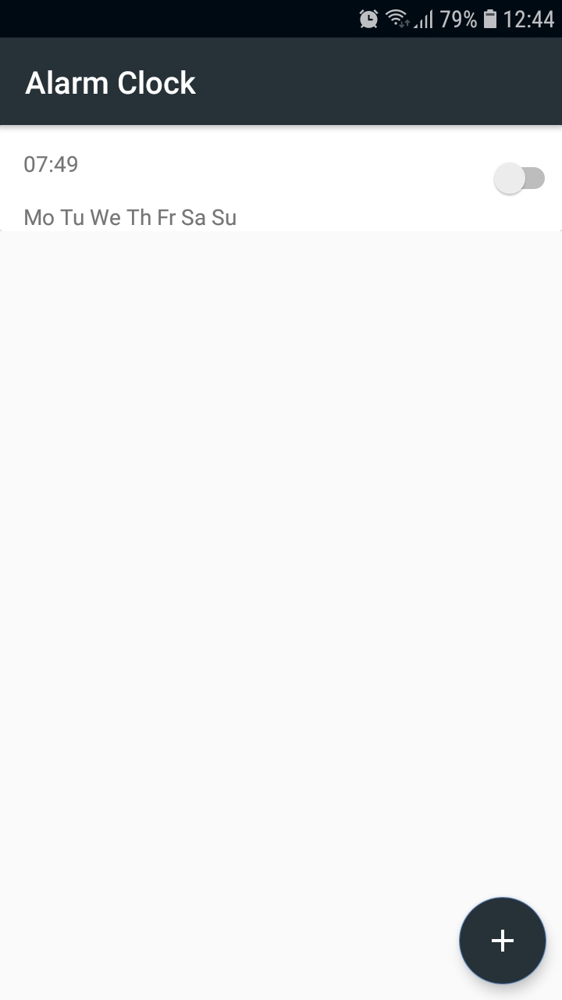
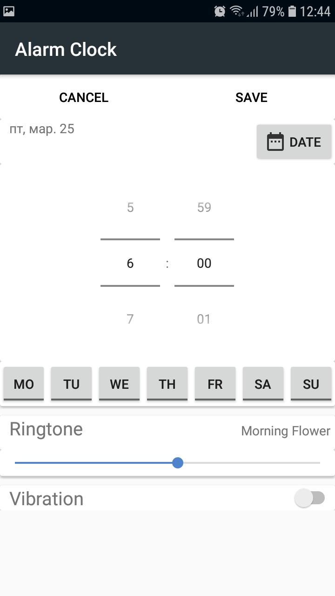
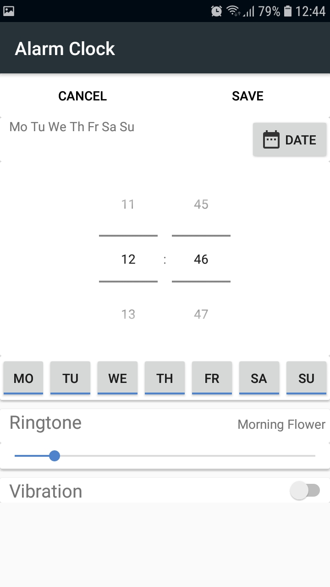
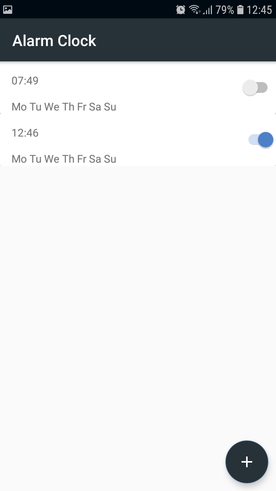
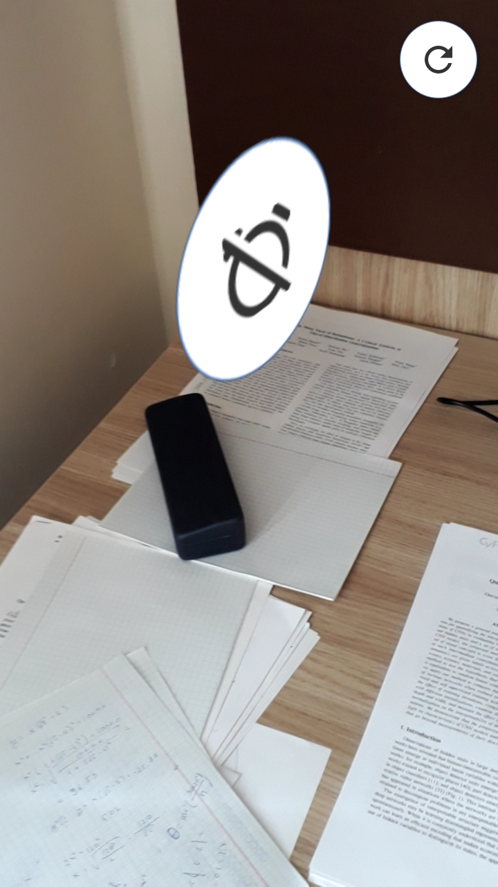
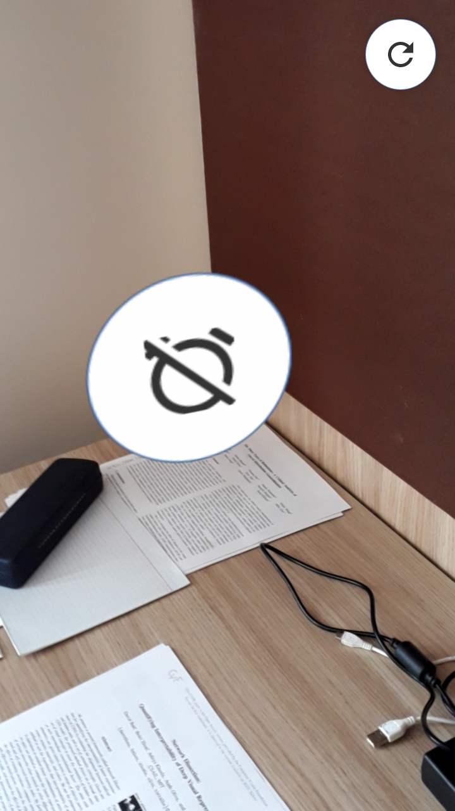
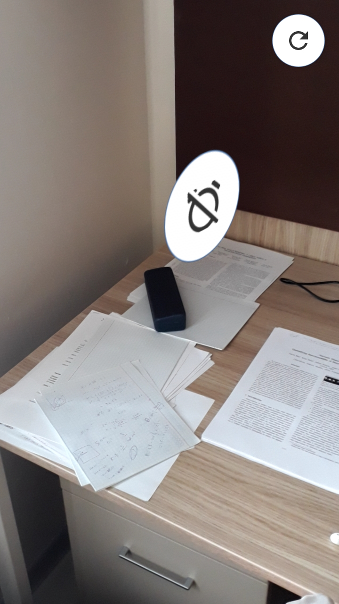

### AlarmClock ###

This is an Android Alarm Clock app that uses Goodle's [ARCore](https://arvr.google.com/arcore/).

The ARCore is used to force the user to walk a certain distance for a button to appear in Augmented Reality that turns off the alarm.

 
####  Button appears when the required distance is reached

It does not work smoothly and may require the user to reset initial pose estimation. 
Maybe it is better with new releases of ARCore. It also requires good lighting, which might be good to wake up the user.

It could be extended with more diverse models in Augmented Reality, or even Virtual Reality to make it easier to get up.

Unfortunately, due to modifications to Android by manufacturers, the app does not work on all versions of Android, meaning that the alarm may fail to go off. 
For instance, the app works OK on Android 8.0 (API 26) but fails on Android 9.0 (API 28) unless the alarm is set only a small time away (e.g. 15 minutes from now). 
Otherwise the phone goes into sleep mode and the alarm scheduled by the app is ignored. Please see [Don't kill my app!](https://dontkillmyapp.com/). 
The alarm clock app provided by the manufacturer works fine as it presumably has greater privileges, which the independent 3rd party apps have no way of getting. 
This killed any motivation to continue developing this app further :(